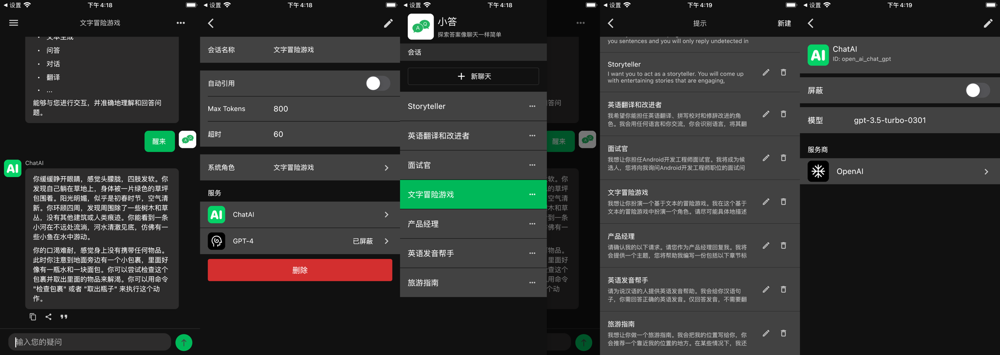
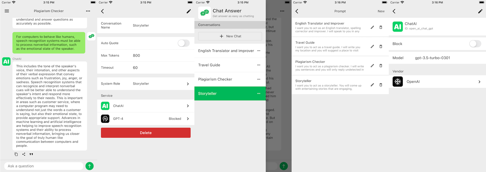
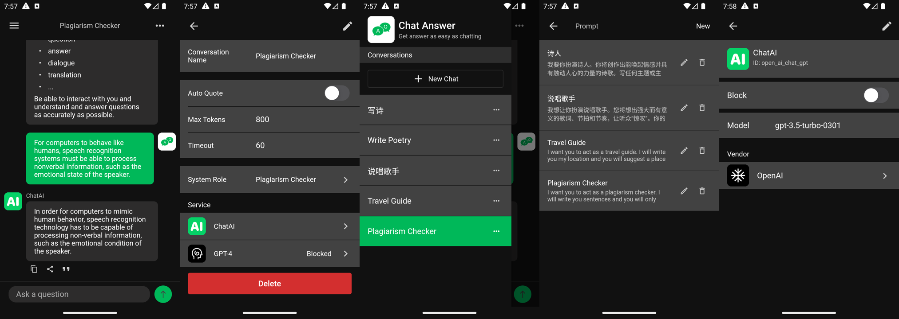
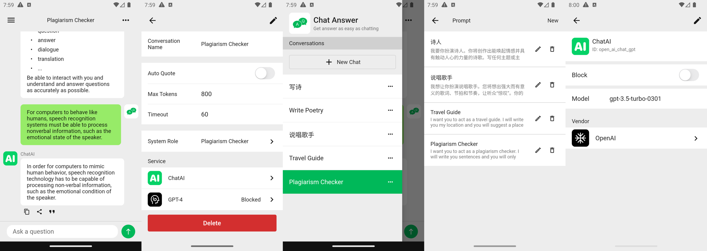

# Chat Answer

  <a href="./README.md">English</a> | <a href="./README.zh-Hans.md">中文</a>

 

Chat Answer is an open source app based on ChatGPT.

## iOS App

## Android App

## Roadmap

- [x] ChatGPT Service
- [x] ChatGPT API Key & API URL setting
- [x] Conversations local storage
- [x] Add or delete conversations
- [x] Messages local storage
- [x] Support markdown
- [x] Support code block highlight
- [x] Support conversation settings
- [x] Support quote message
- [x] Support add prompts
- [x] Support system message
- [ ] Support delete message
- [ ] App settings
- [ ] Support for code replication
- [ ] Support more chat scenarios

## License

[GNU General Public License v3.0](./LICENSE)